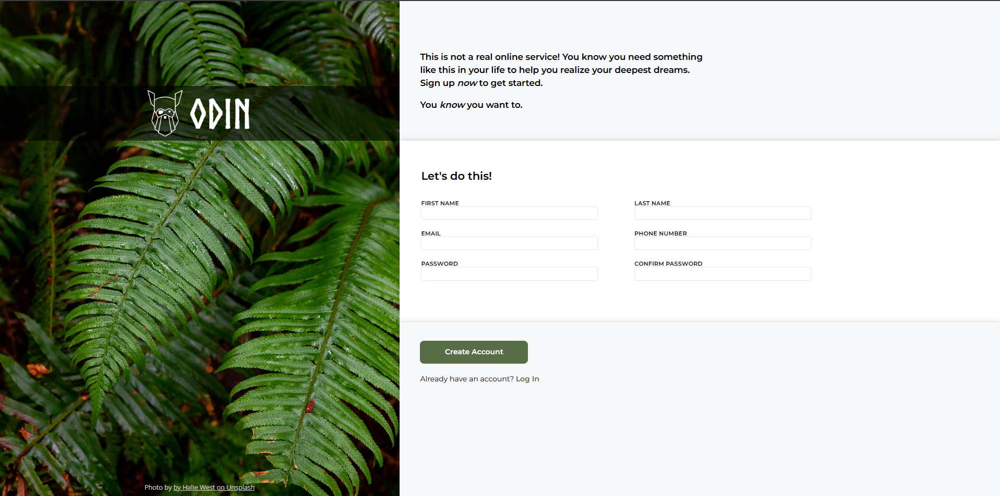

# Sign-Up Form
A sign-up form for an imaginary service built with HTML and CSS featuring custom styling, form validation states, and background imagery. This project is part of [The Odin Project's Intermediate HTML and CSS course](https://www.theodinproject.com/lessons/node-path-intermediate-html-and-css-sign-up-form).

## Screenshot

  

## Live Demo
📝 [Try the Sign-Up Form](https://ar1ze.github.io/odin-sign-up-form/)

## Key Technologies & Concepts
• HTML  
• CSS/SCSS  
• Custom Fonts (@font-face)  
• Flexbox Layout  
• Form Styling  
• Pseudo-classes (:focus, :invalid)  
• Background Images  
• SCSS Variables & Partials